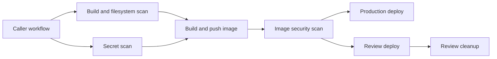

# ci-workflows

Reusable GitHub Actions workflows for projects owned by
[`yongchenglow`](https://github.com/yongchenglow).

The library supports a standard delivery stack built around Bun, Docker, GHCR,
Helm, Kubernetes, and Cloudflare. Build and security workflows apply to any
repository that meets their caller contract. Deployment workflows provide a
generic interface for projects using the supported infrastructure.

## Delivery flow



Caller repositories own event triggers and orchestration. Reusable workflows
own the shared implementation for checks, image publication, scanning, and
deployment.

## Workflow catalogue

| Workflow | Purpose |
| --- | --- |
| `reusable-build.yml` | Run Bun linting, type checks, tests, dependency checks, and a Trivy filesystem scan. |
| `reusable-secret-scan.yml` | Scan Git history with Gitleaks. |
| `reusable-docker.yml` | Build and optionally publish a container image. |
| `reusable-security-scan.yml` | Scan a published image and block critical vulnerabilities. |
| `production-deploy.yml` | Deploy a Helm release and configure its Cloudflare route. |
| `production-rollback.yml` | Validate and roll back the production Helm release. |
| `review-deploy.yml` | Allocate a stable NodePort and deploy a review environment. |
| `review-cleanup.yml` | Remove review resources and release their NodePort. |

## Quick start

A caller invokes a reusable workflow as a job. It must grant the permissions
required by the called workflow. GitHub documents this behavior in
[Reuse workflows](https://docs.github.com/en/actions/how-tos/reuse-automations/reuse-workflows).

```yaml
jobs:
  build:
    permissions:
      contents: read
      security-events: write
    uses: yongchenglow/ci-workflows/.github/workflows/reusable-build.yml@v2
    with:
      bun_version: 1.4.2

  docker:
    needs: build
    permissions:
      contents: read
      packages: write
    uses: yongchenglow/ci-workflows/.github/workflows/reusable-docker.yml@v2
    with:
      bun_version: 1.4.2
      platforms: linux/amd64
    secrets: inherit
```

The reusable workflow checks out the caller repository. This gives deployment
jobs access to the caller's Dockerfile, Helm chart, values files, variables,
secrets, and deployment history.

## Documentation

- [Consumer guide](docs/consumer-guide.md) covers prerequisites, configuration,
  permissions, and every workflow interface.
- [Operations guide](docs/operations.md) explains production and review
  lifecycles, shared state, rollback, cleanup, and recovery.
- [Maintainer guide](docs/maintainer-guide.md) covers safe changes, validation,
  compatibility, and releases.

## Versioning

The current interface is v2. Consumers may follow the floating `v2` tag for
compatible updates or pin an immutable release such as `v2.0.0`. A full commit
SHA provides the strongest protection against changes to dependencies, as
described by GitHub's
[secure use guidance](https://docs.github.com/en/actions/reference/security/secure-use).

Breaking caller contract changes require a new major version. Existing `v1`
tags remain unchanged.
