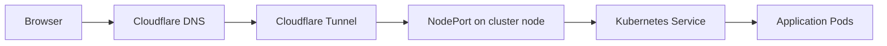
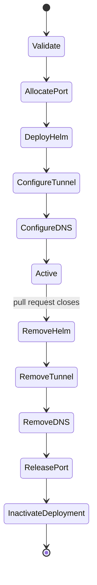

# Operations guide

This guide explains the state changed by deployment workflows and how to
inspect failures safely. It assumes the caller satisfies the
[consumer contract](consumer-guide.md).

## Runtime architecture

Production and review traffic use a Cloudflare DNS record and remotely managed
tunnel ingress. Each hostname routes to a Kubernetes NodePort reachable from
the host that runs `cloudflared`.



Cloudflare documents remotely managed tunnel configuration in its
[Tunnel API](https://developers.cloudflare.com/api/resources/zero_trust/subresources/tunnels/subresources/cloudflared/).
Kubernetes documents NodePort behavior in
[Service type NodePort](https://kubernetes.io/docs/concepts/services-networking/service/#type-nodeport).

The `http://localhost:<node-port>` tunnel target assumes `cloudflared` can
reach NodePort services through localhost. Confirm that routing behavior on
every cluster node that runs the connector.

## Production deployment

`production-deploy.yml` performs these operations in order.

1. Validate caller inputs and required secrets.
2. Configure Kubernetes access.
3. Run `helm upgrade --install` with the caller chart and values.
4. Wait for Deployments carrying the Helm instance label.
5. Update the remotely managed tunnel while preserving unrelated settings and
   the final catch-all rule.
6. Create or update the proxied CNAME for the production hostname.

The production namespace, Helm release, hostname, and NodePort are stable
caller-owned values. Changing one can create a second resource rather than
updating the existing deployment.

### Production checks

Inspect state without changing it.

```sh
helm status <release> -n <namespace>
helm history <release> -n <namespace> --max 10
kubectl get deployment,service,pod -n <namespace>
kubectl rollout status deployment -l "app.kubernetes.io/instance=<release>" -n <namespace>
```

Check the Cloudflare dashboard or API for both the hostname's DNS record and
its tunnel ingress entry. The catch-all `http_status:404` entry must remain
last.

## Production rollback

`production-rollback.yml` is intended for manual dispatch through a caller.
It checks that the latest GitHub deployment is successful and that Helm has a
previous revision. It then rolls back one revision and waits for the matching
Deployment.

Rollback changes Kubernetes state only. It does not change the production
hostname, DNS record, tunnel route, or image tags stored in the registry.

If validation reports revision 1, deploy a corrected release. There is no
earlier Helm revision to restore.

## Review lifecycle



For application `storefront` and review `pr-42`, the workflow uses these
identities.

| Resource | Derived identity |
| --- | --- |
| Kubernetes namespace | `storefront-pr-42` |
| Port allocation key | `storefront-pr-42` |
| Public hostname | `pr-42.<review-domain>` |
| GitHub environment | `review/pr-42` |

The application name makes namespaces and allocations safe across projects.
Each application name must therefore be unique within the shared cluster.

### Port allocation

Review NodePorts come from `31000` through `31999`. The
`ci-workflows-review-ports` ConfigMap in `default` stores stable mappings.
Redeploying the same review reuses its port.

`ci-workflows-infra-lock` protects port allocation and Cloudflare
ingress updates. A workflow waits for up to three minutes. A lock older than
two minutes may be removed after an ownership check.

The allocator tracks ports assigned through this library. It does not discover
manually created NodePort services. Cluster operators must keep
`31000-31999` reserved for review workflows.

### Review cleanup

Cleanup attempts all independent operations and reports a final failure if any
operation fails.

- Remove the Helm release and review namespace
- Remove the tunnel ingress entry
- Remove the DNS record
- Release the NodePort mapping
- Mark GitHub deployments inactive

Use the same identity inputs for deploy and cleanup. Cleanup is idempotent when
resources are already absent.

## Failure recovery

### Helm deployment failed

Inspect Helm status, events, Pods, and the selected values.

```sh
helm status <release> -n <namespace>
kubectl get events -n <namespace> --sort-by=.lastTimestamp
kubectl get pods -n <namespace>
kubectl describe pod <pod> -n <namespace>
```

Confirm that the image pull secret exists in the production namespace.
Review deployment copies that secret into the review namespace before Helm
runs.

### Review cleanup partially failed

Open the failed GitHub Actions run and identify the failed cleanup step.
Rerun the cleanup workflow with the same inputs. Successful steps tolerate
already absent resources.

Inspect the mapping before changing it manually.

```sh
kubectl get configmap ci-workflows-review-ports -n default -o yaml
```

Delete a mapping only after confirming that no Service uses its NodePort and
that the review namespace is gone.

### Infrastructure lock timed out

Inspect the lock owner and timestamp.

```sh
kubectl get configmap ci-workflows-infra-lock -n default -o yaml
```

Check GitHub Actions for a run matching the owner. Let an active run finish.
The workflow removes stale locks automatically after the ownership check. Any
manual deletion is a cluster mutation and requires explicit authorization.

### Cloudflare update failed

Confirm the API token can edit DNS and the remotely managed tunnel. Check the
account ID, tunnel ID, zone, and derived hostname. Cloudflare's
[DNS record API](https://developers.cloudflare.com/api/resources/dns/subresources/records/methods/create/)
documents DNS write access.

Before editing tunnel configuration manually, save its current value. Preserve
all unrelated ingress rules and keep the catch-all rule last.

### Hostname resolves but the application is unavailable

Check each hop in order.

1. Confirm the proxied CNAME exists.
2. Confirm tunnel ingress maps the hostname to the expected NodePort.
3. Confirm the NodePort Service exists.
4. Confirm the Service has ready endpoints.
5. Confirm the Deployment rollout succeeded.

```sh
kubectl get service,endpoints -n <namespace>
kubectl get deployment,pod -n <namespace>
```

## v1 to v2 migration

Version 2 replaces consumer-specific names with caller-owned identity. Before
switching a caller, close or clean up active v1 review environments. Version 2
uses new shared ConfigMaps and does not delete legacy mappings or locks.

Preserve an existing production deployment by passing its current namespace,
release name, hostname, and NodePort explicitly. Update deployment and cleanup
callers together, then exercise a full review lifecycle after the `v2` tag is
published.
